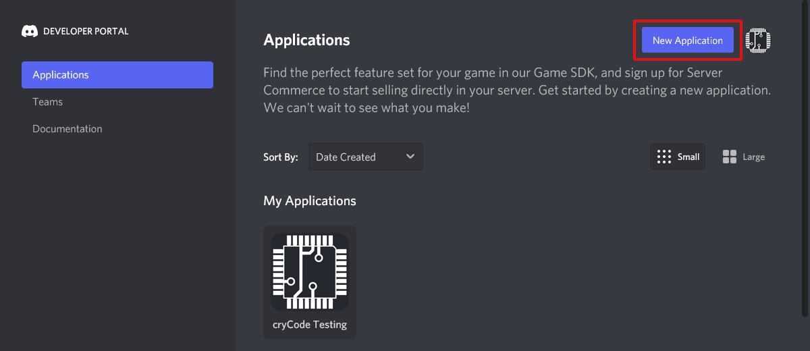
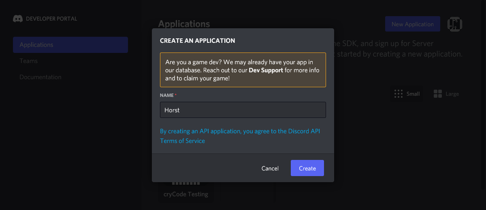
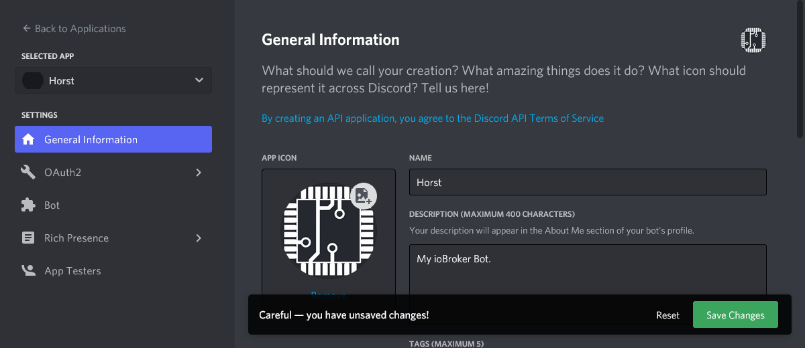
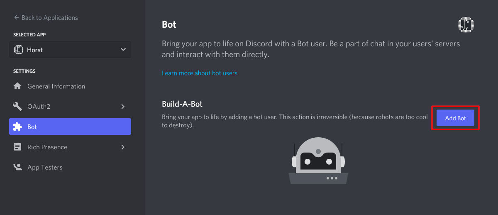
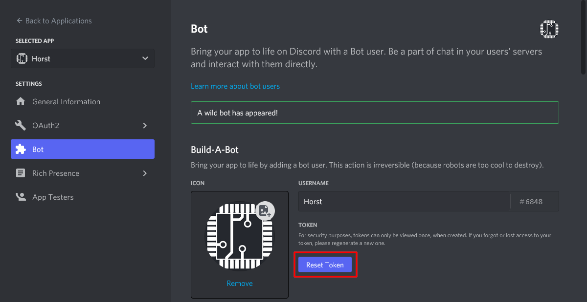
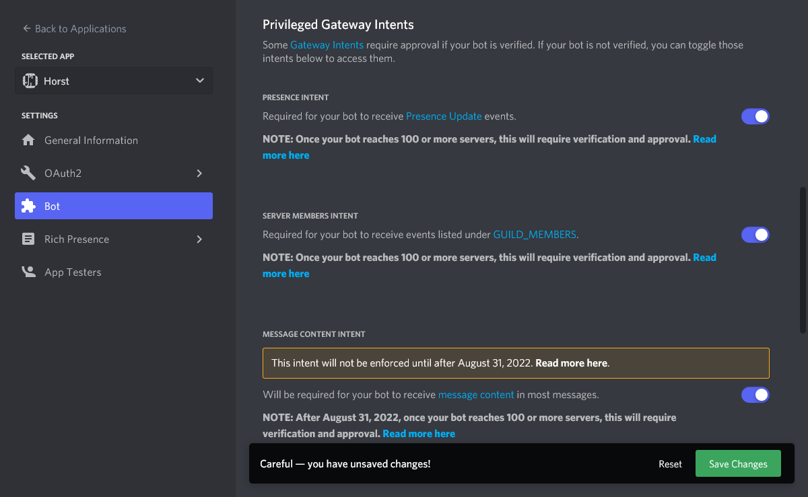
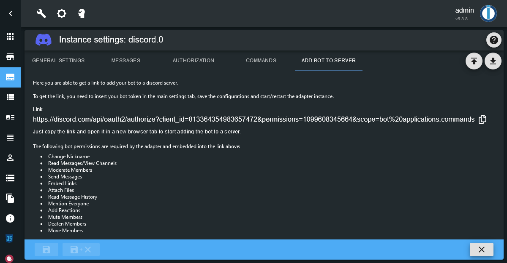
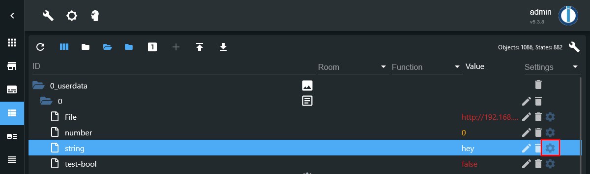
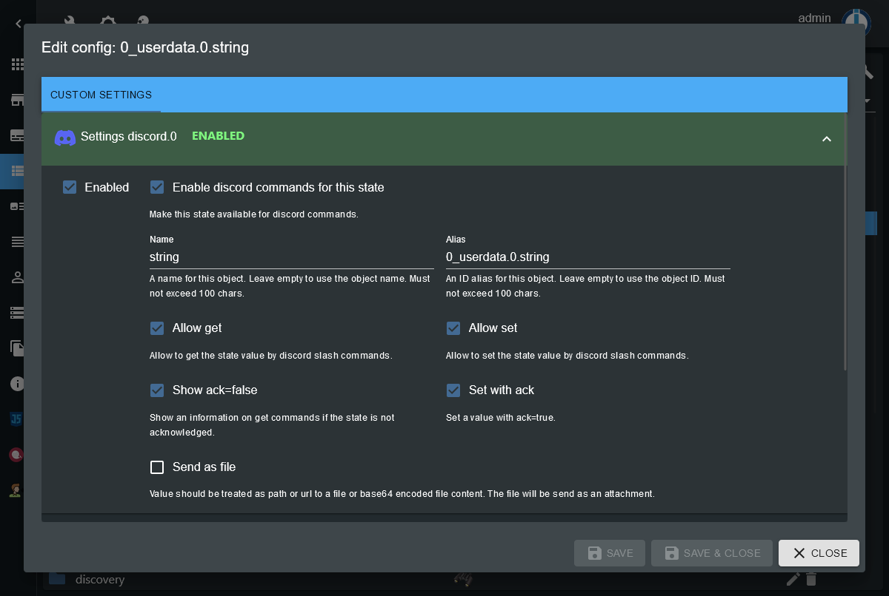

# ioBroker.discord


This ioBroker adapter integrates a discord bot into ioBroker.

The adapter will create an object tree including objects and states for server and channel where the bot is on.
Also an object tree with all users seen by the bot will be created.  
Using this states it's possible to receive and send messages and files on discord.

Additionally the adapter can register discord slash commands to get and set ioBroker state values.

## Features

* ioBroker states for all servers of the bot to receive and send messages
* ioBroker states for all users seen by the bot to receive and send messages
* Set the bot status including actions
* Optional observe user presence status
* Optional observe server member voice status
* Server member voice actions (mute, deafen, disconnect)
* Handle all messages or only messages with bot mentions on server channels
* Handle direct messages
* Optional automatic react with a emoji on mentions
* `.json` states for channel, user and message data
* Send messages, send files, send reactions (emojis), send reply messages, or send custom json-formated message contents
* List server and channel members including member roles
* Support for discord slash commands to get and set state values
* Support for [text2command](https://github.com/ioBroker/ioBroker.text2command) (has to enabled for each `.message` state where it should be used)

Missing some feature? Feel free to submit a feature request on [GitHub](https://github.com/crycode-de/ioBroker.discord/issues/new/choose).

## Creating a Discord bot

To use this adapter, you need to create a Discord bot application.

1. Got to the [Discord Developer Portal](https://discord.com/developers/applications) and login with your Discord account if not already logged in.
2. In the _Applications_ view, click the button _New Application_ in the top right.  
[](./media/bot-creation-1.png)
3. Choose a name for your application (this will be the name of your bot) and click _Create_.  
[](./media/bot-creation-2.png)
4. (Optional) Upload an _App Icon_, edit the _Name_, edit the _Description_, add some _Tags_ and _Save Changes_.  
[](./media/bot-creation-3.png)
5. Navigate to _Bot_ in the left menu and click the _Add Bot_ button.  
[](./media/bot-creation-4.png)  
In the following dialog click _Yes, do it!_ to confirm the bot creation.
6. When the bot is created, you need to click the _Reset Token_ button once to get you bot token.  
[](./media/bot-creation-5.png)  
Since this will invalidate any former token, you need to confirm this by clicking the _Yes, do it!_ button in the dialog popping up.  
After this, your token is displayed **once** and you should copy it to a secure place (e.g. the adapter instance configuration).
7. Scroll down a bit at the _Bot_ page to the _Privileged Gateway Intents_ and enable _Presence Intent_, _Server Members Intent_ and _Message Content Intent_. Don't forget to click _Save Changes_.  
[](./media/bot-creation-6.png)  
Note: Once your bot reaches 100 or more servers, the intents will require verification and approval.
8. Now you are ready to start the adapter instance and add the bot to a Discord server.

## Adding the bot to a server

To add the bot to a server, you need to go to the adapter instance configuration to the tab _Add bot to server_.
There you get a link which you can use to add the bot to a server, while setting the correct scopes and permissions.

[](./media/add-bot-to-server.png)

The following bot permissions are required:

* Change Nickname
* Read Messages/View Channels
* Moderate Members
* Send Messages
* Embed Links
* Attach Files
* Read Message History
* Mention Everyone
* Add Reactions
* Mute Members
* Deafen Members
* Move Members

Also the following scopes are required:

* bot
* applications.commands

If some of the above permissions or scopes are missing, some features of the adapter might not work.

## States

Each server, channel and user is identified by it's unique numeric ID.  
Because names may change, the object tree created by the adapter uses these IDs to create a reliable structure.

The whole object tree is build from what bot can see. So it is possible, for example, that a server has more channels as displayed.

### discord.0.bot.*

| Name | Description |
|---|---|
| `activityType` | The type of the bot activity. One of `PLAYING`, `STREAMING`, `LISTENING`, `WATCHING`, `COMPETING` or an empty string. |
| `activityName` | The name of the bot activity. Only used if a type is set. |
| `status` | The presence status of the bot. One of `online`, `idle`, `dnd` and `invisible`. |

This is used to set the presence status and activity of the bot which should be displayed to users.

### discord.0.servers.\<server-id\>.*

| Name | Description |
|---|---|
| `channels.*` | Channels of the server. |
| `members.*` | Members of the server. |

### discord.0.servers.\<server-id\>.channels.\<channel-id\>.*

| Name | Description |
|---|---|
| `channels.*` | Only present if the channel is a category. Structure is the same as in server channels. |
| `memberCount` | Number of members in the channel. |
| `members` | Comma separated list of members (display names) in the channel. |
| `message` | Last received message in the channel. |
| `messageId` | The ID of the last received message. |
| `messageAuthor` | The author (tag) of the last received message. |
| `messageTimestamp` | Timestamp of the last received message. |
| `messageJson` | JSON data for the last received message. |
| `send` | Send some text or JSON formated message. |
| `sendFile` | Send a File. |
| `sendReply` | Send a reply to a received message. |
| `sendReaction` | Send a reaction (emoji) to a received message. |
| `json` | JSON data of the channel information. |

For all `message*` and `send*` states see messages section below.

### discord.0.servers.\<server-id\>.members.\<user-id\>.*

| Name | Description |
|---|---|
| `tag` | The unique tag of the user in discord. |
| `displayName` | The display name of the user on the server. |
| `roles` | Comma separated list of roles of this member on the server. |
| `joinedAt` | Time when the user joined the server. |
| `voiceChannel` | Currently connected voice channel of the user. Empty string if not connected. |
| `voiceDisconnect` | Button to disconnet the user from voice. |
| `voiceSelfDeaf` | Indicator if the users voice is deafened by the user. |
| `voiceSelfMute` | Indicator if the users voice is muted by the user. |
| `voiceServerDeaf` | Indicator if the users voice is deafened by the server. Can also be used to set the server deafen state. |
| `voiceServerMute` | Indicator if the users voice is muted by the server. Can also be used to set the server mute state. |
| `json` | JSON data of the member information. |

For the `voice*` states to be up to date, the option _Observe user voice state_ in the instance configuration must be enabled.  
To use the `voiceDisconnect`, `voiceServerDeaf` and `voiceServerMute` actions, the bot needs to have the related permissions on the server.

### discord.0.users.\<user-id\>.*

| Name | Description |
|---|---|
| `tag` | The unique tag of the user in discord. |
| `status` | The presence status of the user. One of `online`, `offline`, `idle`, `dnd` |
| `activityType` | The type of the current user activity. One of `PLAYING`, `STREAMING`, `LISTENING`, `WATCHING`, `COMPETING`, `CUSTOM` or an empty string. |
| `activityName` | The name of the current user activity. E.g. the name of a game while `PLAYING`. |
| `avatarUrl` | URL to the avatar of the user. |
| `bot` | Indicator if the user is a bot. |
| `message` | Last received direct message from the user. |
| `messageId` | The ID of the last received direct message from the user. |
| `messageTimestamp` | Timestamp of the last received direct message from the user. |
| `messageJson` | JSON data for the last received direct message from the user. |
| `send` | Send some text or JSON formated message. |
| `sendFile` | Send a File. |
| `sendReply` | Send a reply to a received message. |
| `sendReaction` | Send a reaction (emoji) to a received message. |
| `json` | JSON data of the channel information. |

For the `status` and `activity*` states to be up to date, the option _Observe user presence_ in the instance configuration must be enabled.

For all `message*` and `send*` states see messages section below.

## Authorization

By default, authorization is enabled and only authorized users are able to
interact with the adapter.

The authorized users can be configured in the adapter configuration including
some per-user permissions.  
The users are identified by their internal user ID, so changes of the user tag
don't affect the authorized users list.

It's possible to disable the authorization, but this should be done only if any
user on any server of the bot can be trusted!

## Messages

The adapter is able to receive and send messages from/to discord text channels and users.

By default, in channels only messages with mentions of the bot are processed.
To process messages without mentions too, the option _Process all messages in server channels_ needs to be enabled in the configuration.

When a messages with a bot mention is received, the adapter will react to the message with an emoji.
This can be customized in the adapter configuration.  
If authorization is enabled, the bot will only react on mentions of authorized users.

### Receiving messages

Received messages will be stored in the `.message*` states of the channel object
for server channel messages or of the user object for direct messages.

If authorization is enabled, by default only messages from authorized users will be stored.
This can be configured using the _Process messages from unauthorized users_ option
in the adapter configuration to strore all received messages, even from unauthorized users.

The last received message per channel/user is always stored in the `.message` state.
The timestamp, author and ID of the last received message is stored in the appropriate states.  
Additionally all these information are stored in json format in the `.messageJson` state.

#### Using text2command

To use text2command, a text2command instance must be selected in the adapter configuration.

For each `.message` state the custom option _Enable text2command for this state_ can be activated.  
When activated, each received message will be send to the selected text2command instance.

The response from text2command is send as a reply, send as a normal message or
not send, depending on the adapter configuration.

### Sending messages

To send a message, you can write contents to the `.send*` states of a channel or a user.

#### Sending simple texts

To send a simple text, just write the text into the `.send` state of your target.  
You may use [Markdown](https://support.discord.com/hc/en-us/articles/210298617-Markdown-Text-101-Chat-Formatting-Bold-Italic-Underline-) for text formatting like in your Discord client.

To mention a user you can use the user ID in the form `<@user-id>`.  
For group mentions use `<@&group-id>` and for channel mentions use `<#channel-id>`.

Examples: `This is my message.`, `This is _my_ **formatted** message.`, `Hey <@490222742801481728>!`

#### Sending files

To send a file as an attachment, you can write the file location into the `.sendFile` state of your target.

The file location may be a …

* Absolute or relative link to a local file.  
  Relative links are relative to the adapter directory of your ioBroker installation.  
  The link may optionally be prepended by `file://`.
  Examples: `/home/user/image.png`, `../../iobroker-data/files/myfile.txt`, `file:///tmp/image.jpg`

* URL to a remote file.  
  Example: `https://www.iobroker.dev/images/iobroker.png`

* Base64 encoded file content.  
  Example: `data:image/png;base64,iVBORw0KGgoAAAANSUhEUgAAABAAAAAQCAYAAAAf8/9hAAACzklEQVQ4y3WTy2tcdRTHP+d3753HncncmbaJiYvEhZrU+ii2urJgFCyCLnykpbQrsbR/gRQaXPUPUHBlH4ogUsRSqq7qLtlZrQpKg6Uu1OCkSWZ65859zfzucTExsYLf3Tl8zznf85JHZ5+cVuGcMebg0YXXHN/3UVVAqfk1VJV+HCMiAKRpyuXPr1hrixsCZ10VzgEnXMeRF+afJwgaFIUC0Go1UYVOp4OYUYIoivjiyjWszecUMMaYAyXPk7m5R8jznCjqk2YpjuMQhj1AcT2XLM3oR30GgyFB0KDkeWKMOeAeP7ZgDh16jizNeO/9Dwh7PR7ft5ejRxa49tXXvPnG6yRJzNWrX/LDjz8xMTHOu4tnKJXLLC0tG1OtViVoNKhWK9wLQ9pr6yRJwtTUJC/Oz3P9+jckccrk5APcXd+g3V6jUqkwiqmKKwKIMBrbCKpw585vvHNmkT17dvHQzAylUhkjZocnggi4I0+BAML9sEXBX+27XLj0MXGSMLR2h6cFKLh+zSdoNlHYXtW/oaq019a3bRGhPlYnaDbxaz5GVflHV7lcYlcrYJRH+V9s8VUVN4r6bG5ugginT52k2+ny/c2bADjGMDG+m073HlmWbyvq9XoURUEU9TGO4+C4DsPBgI31DZIkwVqLAs8+8zQnjh/j1Vdevq84Iriei+M4GABByLKMTz+7zMWPPuHBqSkGgwGdbpeZ6WmiXu+/g9nu0E2SRMMwJMty6rUa+596gsOHX+L8hUvEcUyp5PH7H38yMb4bgMbYGFmWE4YhSZKozO3b/7PruI/Nzj7MybffotVqYYwhjmPq9TpBo8Hq6iqFjkpmWcaH5y+ysnKboR3+4lpbfGdtvvfWrV+lUi5T8jyKoqBeq9FqBqiC7/sYM7qAnggrK7fJ8lyBG67AWQWstQeXlpd33lmhVt96535/60aENE0YWmuBbwUW/wZQx0cNXLu4ygAAAABJRU5ErkJggg==`

Additionally you may add a text message to the file. To do so, just write the file
location, followed by a pipe character `|` and your message into the `.sendFile` state.  
Examples: `/tmp/image.png|This is my file`, `https://www.iobroker.dev/images/iobroker.png|The ioBroker logo`

#### Sending reactions

Using the `.sendReaction` state you can react to a previous message with an emoji.
To do so, just write the emoji into the state.

By default the reaction will be send for the message which is currently in the
corresponding `.messageId` state.

If you want to react to a specific message, you can write the message ID, followed
by pipe character `|` and the emoji into the `.sendReaction` state.

Examples: `👍`, `971032590515568660|👍`

#### Sending replies

Using the `.sendReply` state you can send a reply to a previous message.
To do so, just write the reply message into the state.

By default the reply will be send for the message which is currently in the
corresponding `.messageId` state.

If you want to reply to a specific message, you can write the message ID, followed
by pipe character `|` and the reply message into the `.sendReply` state.

Examples: `This is a reply.`, `971032590515568660|This is a reply.`

#### Sending special custom messages

You can send special custom messages writing a stringified JSON message object
into the `.send` state.

The JSON object must of type `MessageOptions`.
For more information read the [discord.js MessageOptions documentation](https://discord.js.org/#/docs/discord.js/stable/typedef/MessageOptions).

Examples:

```json
{
  "files": [
    {
      "attachment": "/tmp/image.jpg",
      "name": "image.jpg",
      "description": "My super image"
    }
  ]
}
```

```json
{
  "content": "Use this:",
  "embeds": [
    {
      "title": "ioBorker.discord",
      "description": "Discord adapter for ioBroker",
      "color": "#5865f2",
      "url": "https://github.com/crycode-de/ioBroker.discord",
      "author": {
        "name": "Peter Müller",
        "url": "https://github.com/crycode-de"
      },
      "image": {
        "url": "https://github.com/crycode-de/ioBroker.discord/raw/main/admin/discord.png"
      },
      "footer": {
        "text": "❤👍"
      }
    }
  ]
}
```

## Slash commands

If enabled in the adapter instance configuration, the adapter is able to handle
Discord slash commands. These commands can be used to get or set ioBroker states.

**Note:** You need to configure the states individually, which you want to be
available for Discord slash commands. See below.

Discord slash commands can be registered as server commands (default) or as
global commands by the adapter instance. This can be configured in the adapter
instance configuration.  
Using server commands has the benefit, that changes to the commands (e.g. added states)
are applied instant without any delay. But server commands can't be used in
direct messages between a user and the bot.  
Global commands can be used in direct messages too, but any change to the commands
may take up to one hour to apply. This is a limitation from Discord and not the adapter.

The default used slash commands are `/iob-get` and `/iob-set`. The command names
and descriptions can be configured in the adapter configuration.

### Configure states for slash commands

For each state which should be available for Discord slash commands, you need to
enable this in the custom settings of the state.
To do so, just click the _Custom settings_ gear icon in the _Objects_ view in
admin, enable the settings for your adapter instance and activate
_Enable discord commands for this state_.

[](./media/slash-commands-config-1.png)

[](./media/slash-commands-config-2.png)

You can define a _Name_ and an _Alias_ for each state to be used in Discord.
The _Name_ will be shown in autocomplete options for the commands and the
_Alias_ is used as an internal identifier. Both must not exceed 100 characters.

For each state you can define individually if it should be available for set
and/or get commands.  
Also you can enable to show an information on get commands if the state is not
acknowledged and to set a state with ack flag.

For `string` type state objects you may choose to treat the value as a file (file location).  
If this is enabled, the state value will be send like in the `.sendFile` states.  
Using this you can request images via get commands, for example.

For `number` type state objects you can define the number of decimals to round a value to on get commands.

For `boolean` type state objects you can define custom values for `true` and `false` values to show on get commands.

### Get states

To get a state just call `/iob-get state-alias` in your Discord client.  
For the `state-alias` an autocomplete will be shown while entering the command.

Any value will be formated as configured in the state object and the custom
state settings. Optionally an information about a missing ack flag can be added.

### Set states

To set a state just call `/iob-set state-alias new-value` in your Discord client.  
For the `state-alias` an autocomplete will be shown while entering the command.  
The `new-value` will be parsed by the adapter, if the state type is `boolean` or
`boolean`.

You may configure per state, if the value should be set with or without ack flag.

For `boolean` type states, the values `true`, `on`, `yes`, `1` and their corresponding
translations of your language, as well as your per state configured _True value_
will be treated as `true`.
Any other value would be treated as `false`.

For `number` type states, the provided value will be parsed as float number.  
If your ioBroker is configured to use a comma in float numbers, you may provide
the number with a comma or dot as float separator. Otherwise only a dot is allowed.  
If `min` and `max` values are defined in the state object, they are also checked.
